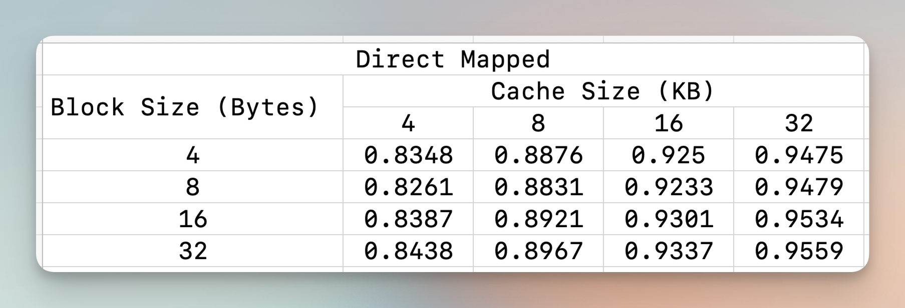
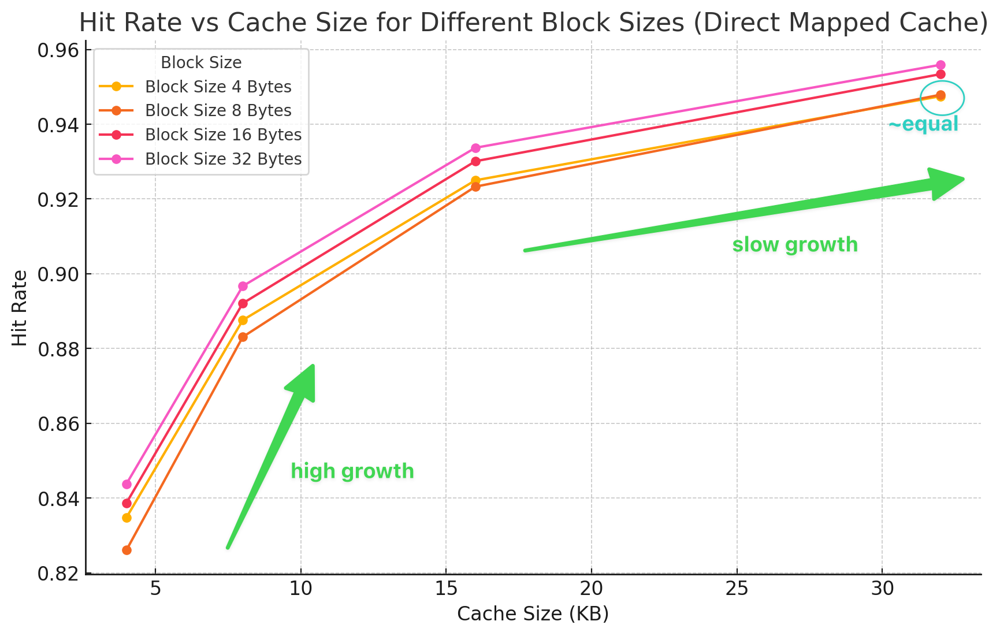
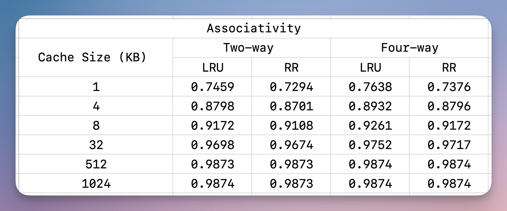
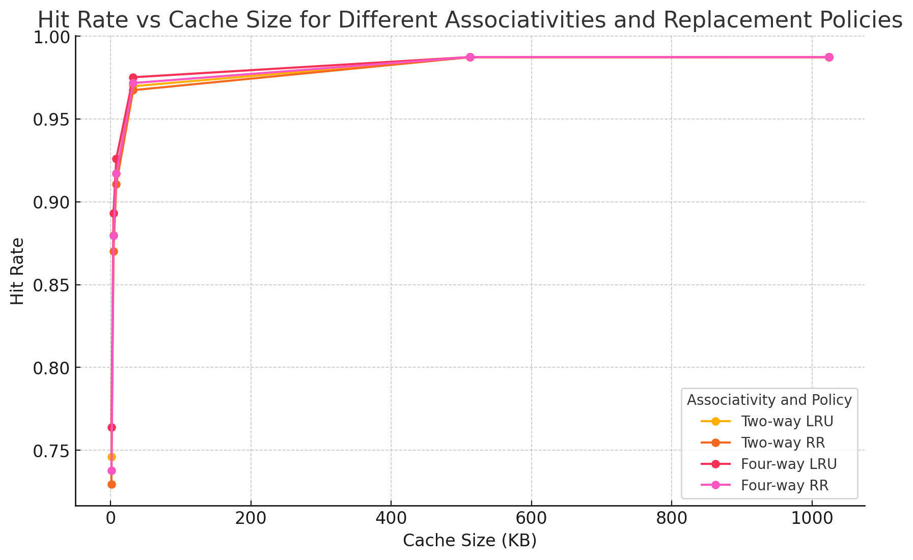
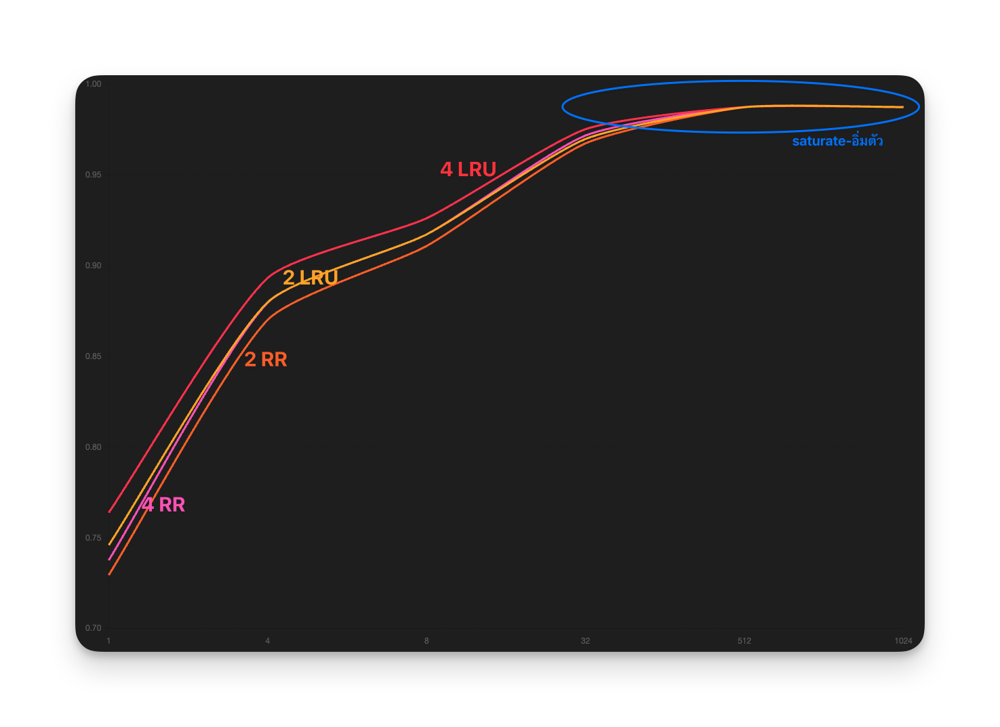

$$Pupipat\ Singkhorn$$
# Assignment II – Cache Design

Please design an experiment (using the cache simulator) for studying the factors that affects the performance of cache accesses. We will address traces from gcc_ld_trace.txt or go_ld_trace.txt as benchmarks. Please fill your results and plot graph of each table. In particular, what does the results suggest about the design of cache.

## a) Block Size Tradeoff on direct mapped cache

```bash
# Compile the CacheSim.c file
gcc -o CacheSim CacheSim.c -lm
```
```bash
# Run the CacheSim file
# Cache size of 4 KB.
# Block size of 4 bytes.
./CacheSim gcc_ld_trace.txt 4 4
```

### results
```bash
! ./CacheSim gcc_ld_trace.txt 4 4
HIT:1669560 MISS: 330441
HitRate:0.8348%

! ./CacheSim gcc_ld_trace.txt 8 4
HIT:1775198 MISS: 224803
HitRate:0.8876%

! ./CacheSim gcc_ld_trace.txt 16 4
HIT:1849934 MISS: 150067
HitRate:0.9250%

! ./CacheSim gcc_ld_trace.txt 32 4
HIT:1895088 MISS: 104913
HitRate:0.9475%

! ./CacheSim gcc_ld_trace.txt 4 8
HIT:1652147 MISS: 347854
HitRate:0.8261%

! ./CacheSim gcc_ld_trace.txt 8 8
HIT:1766215 MISS: 233786
HitRate:0.8831%

! ./CacheSim gcc_ld_trace.txt 16 8
HIT:1846558 MISS: 153443
HitRate:0.9233%

! ./CacheSim gcc_ld_trace.txt 32 8
HIT:1895885 MISS: 104116
HitRate:0.9479%

! ./CacheSim gcc_ld_trace.txt 4 16
HIT:1677463 MISS: 322538
HitRate:0.8387%

! ./CacheSim gcc_ld_trace.txt 8 16
HIT:1784151 MISS: 215850
HitRate:0.8921%

! ./CacheSim gcc_ld_trace.txt 16 16
HIT:1860161 MISS: 139840
HitRate:0.9301%

! ./CacheSim gcc_ld_trace.txt 32 16
HIT:1906747 MISS:  93254
HitRate:0.9534%

! ./CacheSim gcc_ld_trace.txt 4 32
HIT:1687566 MISS: 312435
HitRate:0.8438%

! ./CacheSim gcc_ld_trace.txt 8 32
HIT:1793431 MISS: 206570
HitRate:0.8967%

! ./CacheSim gcc_ld_trace.txt 16 32
HIT:1867498 MISS: 132503
HitRate:0.9337%

! ./CacheSim gcc_ld_trace.txt 32 32
HIT:1911848 MISS:  88153
HitRate:0.9559%
```



- Hit rate แปรผันตรงกับ Cache size นั่นคือ ถ้า Cache size มากขึ้น จะทำให้ hit rate มากขึ้นเช่นกัน
- Block size ที่มากกว่าให้ไม่จำเป็นต้องให้ hit rate ที่สูงกว่าในระดับ cache size เดียวกัน เช่นในรูป block size 4 ให้ hit rate สูงกว่า block size 8
- และจะมีการไปถึงจุดอิ่มตัว เช่นในรูปคือที่ cache size 32KB สังเกตได้ว่า block size 4, 8 แทบจะมี hit rate เท่ากัน
- อัตราการเติบโตของ hit rate: ในช่วงแรกจาก cache size 4 ไป 8 KB จะมีการเพิ่มขึ้นของ hit rate สูงกว่าระดับที่ cache size 16 ไป 32 KB

## b) N-way associative cache with replacement algorithms: Least recently used (LRU), and Round Robin (RR).

```bash
# Compile the CacheSim.c file
gcc -o AssoCacheSim AssoCacheSim.c
```
```bash
# Run the AssoCacheSim file
# <trace_file> gcc_ld_trace.txt
# <cache_size> 1 KB
# <associativity> 2 (two-way)
# <replacement_policy> LRU
./AssoCacheSim gcc_ld_trace.txt 1 2 LRU
```
### results
```bash
! ./AssoCacheSim gcc_ld_trace.txt 1 2 LRU
Cache Size: 1 KB, Associativity: 2-way, Policy: LRU
Hits: 1491704, Misses: 508297, Hit Rate: 74.59%

! ./AssoCacheSim gcc_ld_trace.txt 4 2 LRU
Cache Size: 4 KB, Associativity: 2-way, Policy: LRU
Hits: 1759588, Misses: 240413, Hit Rate: 87.98%

...

! ./AssoCacheSim gcc_ld_trace.txt 1024 4 RR
Cache Size: 1024 KB, Associativity: 4-way, Policy: RR
Hits: 1974753, Misses: 25248, Hit Rate: 98.74%
```




- Hit rate แปรผันตรงกับ Cache size นั่นคือ ถ้า Cache size มากขึ้น จะทำให้ hit rate มากขึ้นเช่นกัน
- 4-way associative มี hit rate มากกว่า 2-way associative เล็กน้อย เมื่อใช้ Replacement Policy เดียวกัน
- LRU มี hit rate มากกว่า RR เล็กน้อย เมื่อใช้ Associativity เดียวกัน
- แต่จะมีการเพิ่มไปถึงจุดอิ่มตัว ที่เมื่อเพิ่ม Cache size มากขึ้น หรือเพิ่ม Associativity หรือปรับ Replacement policy ก็ไม่ทำให้ hitrate แตกต่างกันหรือเพิ่มอีกต่อไป (สำหรับงานที่ทดสอบนี้) เช่นในรูปคือที่ 1024 KB